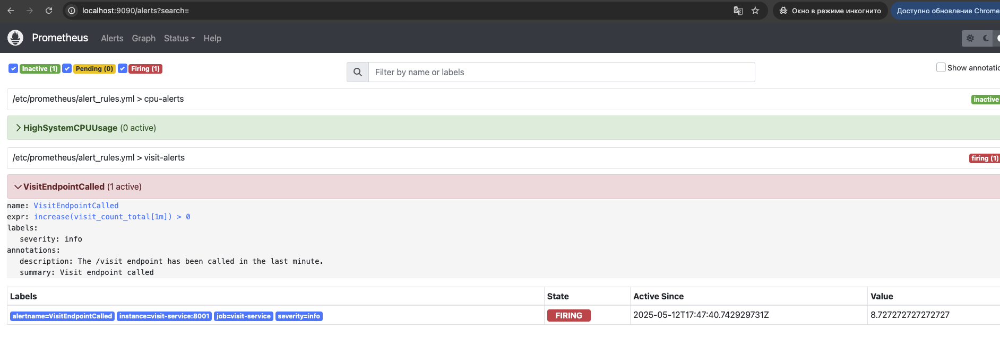

# Visit Service

Этот проект представляет собой микросервис, который отслеживает количество посещений с использованием и предоставляет информацию о погоде из открытого API, кешируя результат запроса на 1 час в Redis. Реализован второй микросервис для получения нотификаций об использовании ручек, связь происходит через брокер сообщений RadditMQ. Логика написана на Python+FastAPI

`Swagger`: http://localhost:5001/docs

## Требования

Перед запуском убедитесь, что у вас установлены следующие инструменты:
- Python 3.8+
- Docker и Docker Compose

## Установка и запуск

1. **Клонируйте репозиторий**:
   ```bash
   git clone https://github.com/EgorProzorov/architecture_final_project
   cd final_project
   ```

2. **Запустите сервисы с помощью Docker Compose**:
   ```bash
   docker-compose up --build
   ```

3. **Проверьте, что сервисы работают**:
   - FastAPI-приложение будет доступно на порту `5001`.
   - Redis и RabbitMQ будут запущены в контейнерах.

4. **Отправьте GET-запрос к сервису**:
   Используйте `curl` или Swagger для проверки работы сервиса:
   ```bash
   curl -X GET http://localhost:5001/visit
   ```

   В ответ вы получите JSON с количеством посещений:
   ```json
   {"visit_count": 1}
   ```
5. **Получение погоды с кэшированием**
   Используйте `curl` или Swagger для проверки работы сервиса:
   ```bash
   curl -X GET "http://localhost:5001/weather?city=London"
   ```
   В ответ вы получите JSON с информацией о погоде в указанном городе:
   ```json
   {
      "source": "api",
      "data": {
      "weather": [...],
      "main": {
         "temp": 15.3,
         ...
      },
      ...
      }
   }
   ```
При повторном запросе в течение часа результат будет возвращён из кэша:
```json
   {
      "source": "cache",
      "data": {
      "weather": [...],
      "main": {
         "temp": 15.3,
         ...
      },
      ...
      }
   }
   ```
### Примечания:

* При каждом обращении к эндпоинту `/weather` в очередь RabbitMQ (notification) отправляется сообщение:

   * "Weather data for <город> retrieved from cache." — если данные были получены из Redis

   * "Weather data for <город> retrieved from API." — если данные были получены от внешнего API

* Также метрики запроса (кол-во и время отклика) передаются в Prometheus:

   * WEATHER_REQUEST_COUNT — счётчик вызовов

   * WEATHER_REQUEST_LATENCY — задержка ответа


---

## Как посмотреть базу данных Redis

1. Найдите ID контейнера Redis:
   ```bash
   docker ps
   ```
   Найдите контейнер с именем, содержащим `redis`.

2. Подключитесь к Redis CLI:
   ```bash
   docker exec -it <redis_container_id> redis-cli
   ```

3. Выполните команды для просмотра данных:
   - Список всех ключей:
     ```bash
     KEYS *
     ```
   - Получить значение ключа `visits`:
     ```bash
     GET visits
     ```

---

## Как посмотреть очередь RabbitMQ

1. Перейдите в веб интерфейс
   ```
   http://localhost:15672
    ```

2. Войдите в веб-интерфейс:
   - Логин: `guest`
   - Пароль: `guest`

3. Перейдите на вкладку **Queues**:
   - Найдите очередь с именем `notification`.
   - Вы можете просмотреть сообщения в очереди или отправить новые.

---

## Метрики

Prometheus: http://localhost:9090 — просмотр метрик, проверка алертов.

Grafana: http://localhost:3000
- Логин: `admin`
- Пароль: `admin`

### Дашборды:


### Аллерты:


---

## Примечания

- Если вы хотите остановить все контейнеры, выполните:
  ```bash
  docker-compose down
  ```
- Убедитесь, что порты `5001`, `6379` и `15672` не заняты другими процессами.